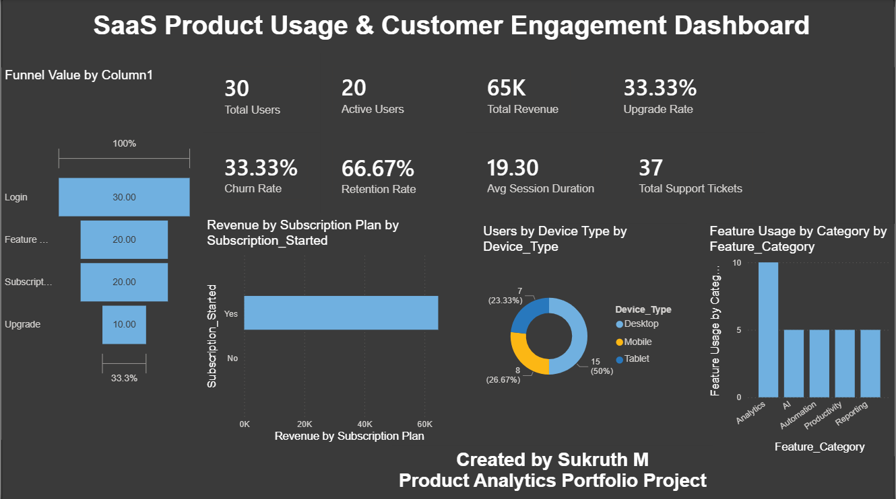

SaaS Product Usage & Customer Engagement Dashboard

📌 Project Overview

This project is an interactive SaaS Product Analytics Dashboard developed using Power BI, MySQL, and Microsoft Excel. The dashboard focuses on analyzing customer engagement, user activity, subscription performance, revenue generation, churn behavior, feature adoption, and upgrade conversions within a SaaS business environment.

The purpose of this project is to simulate a real-world SaaS analytics use case where business stakeholders and product teams can monitor customer behavior and make data-driven decisions using visual analytics.


🎯 Project Objectives

The main objectives of this project are:

- Analyze user engagement and activity patterns
- Monitor customer retention and churn trends
- Track subscription upgrades and conversions
- Understand feature adoption behavior
- Visualize revenue contribution from subscriptions
- Create an executive-level interactive dashboard
- Improve storytelling and business intelligence skills


🛠️ Tools & Technologies Used

| Tool | Purpose |
|------|----------|
| Power BI | Dashboard creation & visualization |
| MySQL | Data querying & KPI calculations |
| Excel | Dataset preparation & cleaning |
| DAX | Custom measures and calculations |
| Data Modeling | KPI structuring and relationships |


📂 Dataset Information

The dataset used in this project simulates SaaS platform user activity and customer engagement metrics.

Dataset Columns Include:

- User_ID
- Session_ID
- Subscription_Plan
- Login_Date
- Session_Duration_Min
- Feature_Used
- Feature_Category
- Device_Type
- Country
- Subscription_Status
- Monthly_Revenue
- Churn_Flag
- Upgrade_Flag
- Support_Tickets
- User_Type
- Login_Status
- Feature_Usage_Status
- Subscription_Active
- Upgrade_Status


📊 Key KPIs

The dashboard includes the following business KPIs:

| KPI | Description |
|-----|-------------|
| Total Users | Total registered SaaS users |
| Active Users | Users actively using the platform |
| Total Revenue | Revenue generated from subscriptions |
| Upgrade Rate | Percentage of users upgrading plans |
| Churn Rate | Percentage of users leaving the platform |
| Retention Rate | Percentage of retained customers |
| Avg Session Duration | Average user session time |
| Total Support Tickets | Number of support requests raised |


📈 Dashboard Visuals

1️⃣ SaaS User Conversion Funnel

Tracks customer journey progression:

- Login
- Active Usage
- Retained Users
- Upgraded Users

This helps identify user drop-offs and conversion effectiveness.


2️⃣ Revenue by Subscription Plan

Visualizes revenue generated across subscription plans to identify the most profitable plans.


3️⃣ Users by Device Type

Shows distribution of users across:

- Desktop
- Mobile
- Tablet

Useful for understanding device usage behavior.


4️⃣ Feature Usage by Category

Analyzes adoption of product features such as:

- Analytics
- AI
- Automation
- Productivity
- Reporting

Helps identify the most engaging features.


📌 Business Insights Generated

Some important insights identified from the dashboard:

- Majority of users successfully move from login to active engagement.
- Upgrade conversions are significantly lower compared to active users.
- Desktop users form the largest user segment.
- Analytics and AI features show higher engagement levels.
- Retention rate is higher than churn rate, indicating healthy customer engagement.
- Subscription revenue is concentrated among active paid plans.


🎨 Dashboard Design Approach

The dashboard was designed using:

- Dark-themed professional layout
- KPI-focused top section
- Funnel-based customer journey visualization
- Balanced visual hierarchy
- Business storytelling principles
- Executive-friendly dashboard structure


📷 Dashboard Preview

(Add your dashboard screenshot here)

Example:



---

📁 Repository Contents

```bash
📦 saas-product-analytics-dashboard
 ┣ 📄 README.md
 ┣ 📊 SaaS_Product_Analytics.pbix
 ┣ 📑 SaaS_Dataset.xlsx
 ┣ 📷 saas_dashboard_preview.png
 ┗ 📄 SQL_Queries.sql
